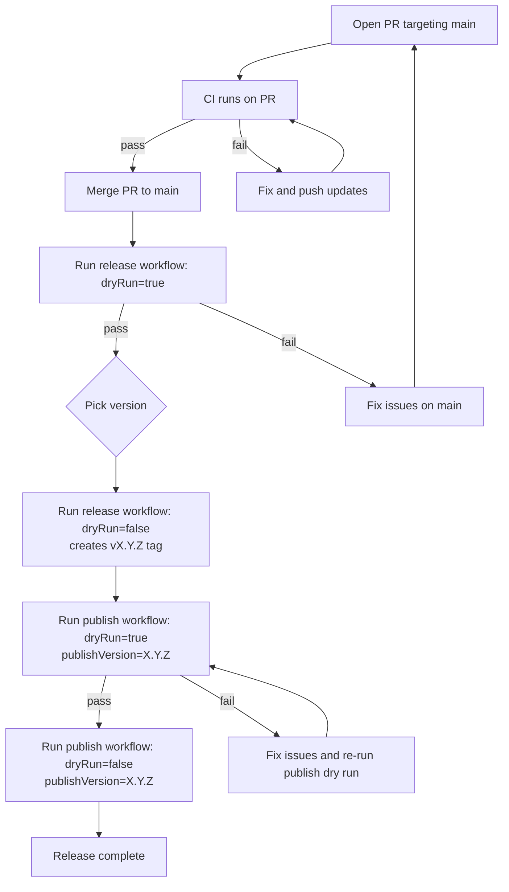

# Official release runbook

## Flow diagram (Mermaid)

This repo uses GitHub Actions workflows to validate, tag, and publish an official release.

Workflows involved:

- **ci**: runs on PRs and pushes to `main` and executes the runtime matrix integration tests.
- **release**: manually suggests/sets the next version and (optionally) pushes an annotated `vX.Y.Z` tag.
- **publish**: manually builds and (optionally) deploys artifacts to Maven Central (via Sonatype Central Portal) and GitHub Packages.

## Release order

1. **Merge changes into `main`**
   - Open a PR and let **ci** run.
   - Do not proceed until **ci** is green for the PR.

2. **Choose the release version**
   - Prefer the version suggested by the **release** workflow, unless you need to override.
   - Keep the tag version and published Maven version aligned.

3. **Run `release` as a dry run** (recommended)
   - Go to Actions → **release** → Run workflow.
   - Inputs:
     - `dryRun: true`
     - `releaseVersion: (empty)` to use the suggested version, or set an explicit override like `1.2.3`.
   - This runs `mvn clean verify` and validates the repo state without creating a tag.

4. **Run `release` for real (creates the tag)**
   - Run the **release** workflow again.
   - Inputs:
     - `dryRun: false`
     - `releaseVersion: <the final version>`
   - Outcome: pushes an annotated tag `v<version>` to GitHub.

5. **Run `publish` as a dry run** (recommended)
   - Go to Actions → **publish** → Run workflow.
   - Inputs:
     - `dryRun: true`
     - `publishVersion: <the same version used for the tag>`
   - This runs a full build/verify with the intended version without deploying.

6. **Run `publish` for real (deploy to Maven Central + GitHub Packages)**
   - Run the **publish** workflow again.
   - Inputs:
     - `dryRun: false`
     - `publishVersion: <the same version used for the tag>`
   - Outcome: deploys to Maven Central via Sonatype Central Portal, and also deploys to GitHub Packages.

## Important notes

- The **release** workflow does **not** change `pom.xml` versions; it only verifies and tags.
- If you publish without `publishVersion`, the workflow deploys whatever version is currently in `pom.xml` (often `*-SNAPSHOT`). For an official release, set `publishVersion` to match the `vX.Y.Z` tag.
- If a run fails, open the run logs in Actions and fix the repo, then re-run starting from **ci**.

